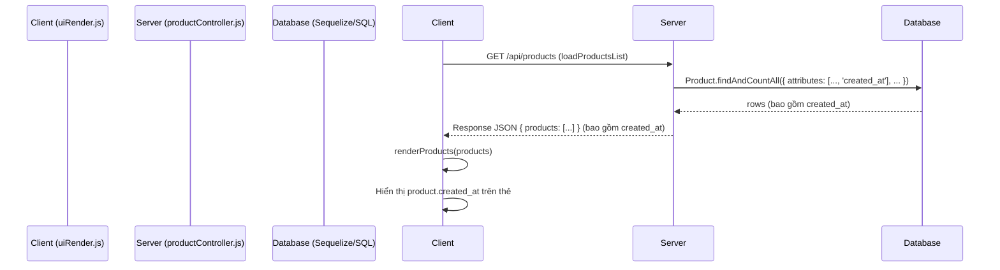

# Kế hoạch: Hiển thị Ngày giờ Tạo Sản phẩm

**Mục tiêu:** Hiển thị ngày và giờ tạo sản phẩm (`created_at`) trên thẻ sản phẩm ở giao diện client.

**Vấn đề:** Dữ liệu `created_at` hiện không được gửi từ server đến client, dẫn đến việc hiển thị "N/A".

**Phân tích:**
- Database và Model (`Product.js`) đã được cấu hình đúng với `timestamps: true` và `underscored: true`.
- Server API (`productController.js`) hiện không chỉ định rõ việc lấy trường `created_at` trong các truy vấn lấy danh sách hoặc chi tiết sản phẩm.
- Client (`uiRender.js`) đã có logic để hiển thị `created_at` nhưng thiếu dữ liệu.

**Kế hoạch chi tiết:**

1.  **Cập nhật Server API (`tiktok-product-manager/server/controllers/productController.js`):**
    *   Trong hàm `getAllProducts`: Thêm tùy chọn `attributes` vào `Product.findAndCountAll` để bao gồm `created_at` và các trường cần thiết khác (`id`, `url`, `image_url`, `notes`, `purchased`, `video_count`).
    *   Trong hàm `getProduct`: Thêm tùy chọn `attributes` vào `Product.findOne` để bao gồm `created_at` và các trường cần thiết khác.
2.  **Xóa mã Debug (`tiktok-product-manager/client/js/modules/uiRender.js`):** Gỡ bỏ dòng `console.log` đã thêm vào hàm `renderProducts` để kiểm tra đối tượng `product`.

**Sơ đồ luồng dữ liệu (Mermaid):**

**Các bước thực hiện (trong chế độ Code):**

1.  Sử dụng `apply_diff` để cập nhật hàm `getAllProducts` trong `productController.js`.
2.  Sử dụng `apply_diff` để cập nhật hàm `getProduct` trong `productController.js`.
3.  Sử dụng `apply_diff` để xóa dòng `console.log` trong `uiRender.js`.