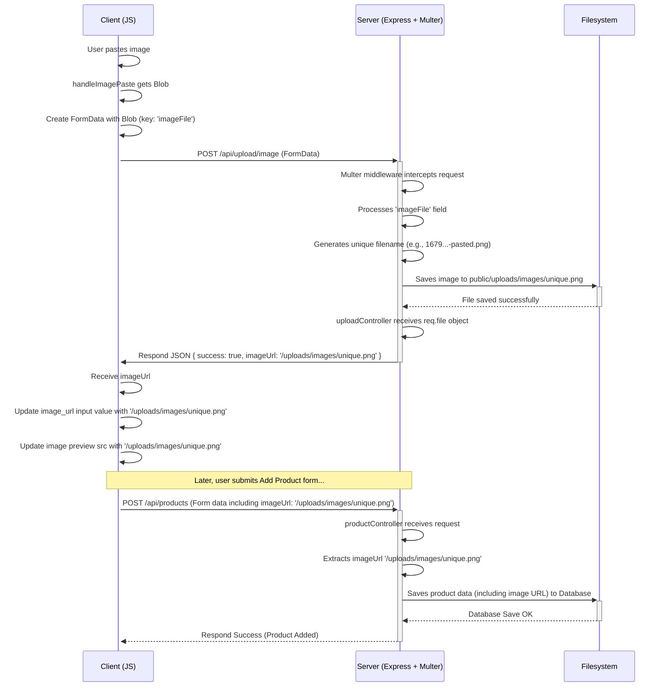

<![CDATA[# Kế hoạch Triển khai Tính năng Dán Ảnh bằng Upload File

**Mục tiêu:** Cho phép người dùng dán ảnh từ clipboard vào form "Add Product", ảnh sẽ được tải lên server và lưu dưới dạng file, thay vì chuyển thành base64 để tránh lỗi `PayloadTooLargeError`.

**Các bước chính:**

1.  **Chuẩn bị Phía Server (Node.js/Express):**
    *   **Cài đặt `multer`:** Thêm middleware `multer` để xử lý việc tải lên file dạng `multipart/form-data`.
        ```bash
        npm install multer --save # Hoặc yarn add multer
        ```
    *   **Tạo Thư mục Upload:** Đảm bảo thư mục `tiktok-product-manager/server/public/uploads/images` tồn tại.
    *   **Cấu hình `multer`:**
        *   Thiết lập nơi lưu trữ (`destination`) là `public/uploads/images`.
        *   Định nghĩa hàm tạo tên file duy nhất (`filename`) để tránh trùng lặp (ví dụ: `Date.now() + '-' + file.originalname`).
    *   **Tạo Route Upload (`tiktok-product-manager/server/routes/upload.js`):**
        *   Import `express`, `multer`, và controller upload.
        *   Khởi tạo `multer` với cấu hình đã định nghĩa.
        *   Định nghĩa route `POST /image`, sử dụng `multer.single('imageFile')` làm middleware để nhận file ảnh.
        *   Gọi hàm xử lý từ controller upload.
    *   **Tạo Controller Upload (`tiktok-product-manager/server/controllers/uploadController.js`):**
        *   Viết hàm `uploadImage(req, res)`:
            *   Kiểm tra `req.file` (do multer thêm vào).
            *   Nếu có file, trả về JSON: `{ success: true, imageUrl: '/uploads/images/' + req.file.filename }`.
            *   Nếu không có file hoặc có lỗi, trả về lỗi 400 hoặc 500.
    *   **Đăng ký Route và Serve Static Files (`tiktok-product-manager/server/app.js`):**
        *   Import route upload: `const uploadRoutes = require('./routes/upload');`
        *   Sử dụng route: `app.use('/api/upload', uploadRoutes);`
        *   Thêm middleware serve static files từ `public`: `app.use(express.static(path.join(__dirname, 'public')));` (Đặt trước các route API khác nếu cần).

2.  **Cập nhật Phía Client (JavaScript):**
    *   **Hoàn tác thay đổi trước đó:** Khôi phục lại đoạn mã `FileReader` trong `tiktok-product-manager/client/js/modules/imageHandlers.js` (hàm `handleImagePaste`).
    *   **Sửa đổi `handleImagePaste` (`imageHandlers.js`):**
        *   Trong `reader.onload`, thay vì gán `dataUrl` vào `inputElement.value`:
            *   Lấy `Blob` từ `item.getAsFile()`.
            *   Tạo `FormData`.
            *   Append `Blob` vào `FormData` với key `imageFile` và tên file (ví dụ: `pasted-image.png`).
            *   Gửi `POST` request đến `/api/upload/image` bằng `fetch` với `FormData` làm body.
            *   Xử lý JSON response:
                *   Nếu thành công (`response.ok` và có `imageUrl`), gán `imageUrl` vào `inputElement.value` và `previewElement.src`.
                *   Nếu lỗi, hiển thị thông báo lỗi.
    *   **(Khuyến nghị)** **Sửa đổi `handleImageUpload` (`imageHandlers.js`):**
        *   Tương tự `handleImagePaste`, thay vì dùng `FileReader`:
            *   Lấy `File` từ `event.target.files[0]`.
            *   Tạo `FormData`.
            *   Append `File` vào `FormData` với key `imageFile`.
            *   Gửi `POST` request đến `/api/upload/image` bằng `fetch`.
            *   Xử lý response và cập nhật input/preview.

**Luồng Dữ liệu (Mermaid):**



**Lợi ích:**

*   Giải quyết lỗi `PayloadTooLargeError`.
*   Tối ưu hóa lưu trữ trong database (chỉ lưu đường dẫn).
*   Giảm tải cho server khi xử lý request tạo/sửa sản phẩm.
*   Tận dụng cơ chế phục vụ file tĩnh và cache của trình duyệt.
]]>