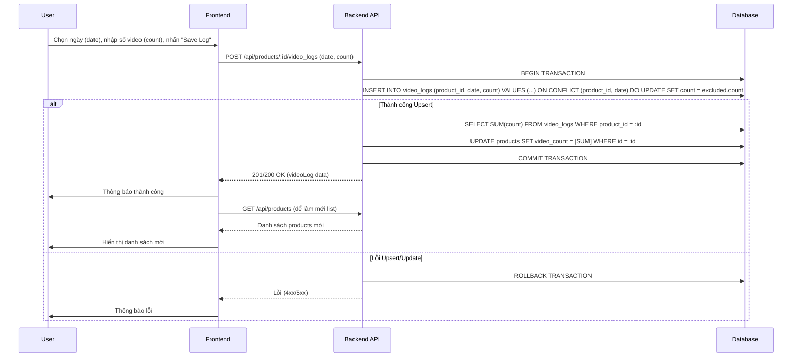

# TikTok Product Manager - Kế hoạch chi tiết (Chuyển sang PostgreSQL)

## 1. Tổng quan

Xây dựng ứng dụng web quản lý sản phẩm TikTok, theo dõi mục tiêu mua hàng và sản xuất video hàng ngày. Ứng dụng sử dụng PostgreSQL làm cơ sở dữ liệu để đảm bảo khả năng mở rộng và bảo trì.

## 2. Công nghệ

-   **Frontend:** HTML, Tailwind CSS, JavaScript (Vanilla), Lucide Icons
-   **Backend:** Node.js, Express
-   **Database:** PostgreSQL
-   **ORM:** Sequelize
-   **Driver PostgreSQL:** `pg`, `pg-hstore`
-   **API:** RESTful
-   **Authentication:** JWT (JSON Web Tokens)
-   **(Tùy chọn - Upload ảnh):** `multer`

## 3. Cấu trúc thư mục (Dự kiến)

```
tiktok-product-manager/
├── client/                  # Code Frontend
│   ├── index.html           # File HTML chính
│   └── js/                  # File JavaScript
│       └── app.js
├── server/                  # Code Backend Node.js
│   ├── config/              # File cấu hình (auth.js)
│   ├── controllers/         # Controllers (auth, product, goal, tag)
│   ├── migrations/          # Files migration database
│   ├── models/              # Models Sequelize (user, product, tag, goal, etc.)
│   ├── middleware/          # Middleware (auth.js)
│   ├── routes/              # Routes API (auth, product, goal, tag)
│   ├── uploads/             # (Tùy chọn) Thư mục lưu ảnh upload
│   ├── app.js               # Cấu hình Express app
│   └── server.js            # Điểm khởi chạy server
├── database/                # (Không dùng nếu kết nối PG server)
│   └── (Có thể bỏ)
├── config/                  # Cấu hình Sequelize CLI
│   └── config.json
├── .env                     # Biến môi trường (JWT_SECRET, PORT, DB_*)
├── .sequelizerc             # Cấu hình đường dẫn cho Sequelize CLI
└── package.json             # Cấu hình project Node.js
```

## 4. Database Schema (PostgreSQL)

```sql
-- Users table
CREATE TABLE users (
  id SERIAL PRIMARY KEY,
  email VARCHAR(255) NOT NULL UNIQUE,
  password VARCHAR(255) NOT NULL, -- Lưu password đã hash
  name VARCHAR(255),
  avatar_url TEXT, -- Có thể là URL hoặc TEXT nếu lưu base64
  created_at TIMESTAMPTZ NOT NULL DEFAULT CURRENT_TIMESTAMP,
  updated_at TIMESTAMPTZ NOT NULL DEFAULT CURRENT_TIMESTAMP
);

-- Products table
CREATE TABLE products (
  id SERIAL PRIMARY KEY,
  user_id INTEGER NOT NULL REFERENCES users(id) ON DELETE CASCADE ON UPDATE CASCADE,
  url TEXT NOT NULL,
  image_url TEXT, -- URL ảnh (từ upload hoặc base64)
  notes TEXT,
  purchased BOOLEAN DEFAULT false,
  video_count INTEGER DEFAULT 0, -- Tổng số video (tính từ video_logs)
  deleted_at TIMESTAMPTZ, -- Cho soft delete
  created_at TIMESTAMPTZ NOT NULL DEFAULT CURRENT_TIMESTAMP,
  updated_at TIMESTAMPTZ NOT NULL DEFAULT CURRENT_TIMESTAMP
);
CREATE INDEX idx_products_user_id ON products(user_id); -- Index cho khóa ngoại

-- Tags table
CREATE TABLE tags (
  id SERIAL PRIMARY KEY,
  name VARCHAR(255) NOT NULL UNIQUE,
  created_at TIMESTAMPTZ NOT NULL DEFAULT CURRENT_TIMESTAMP,
  updated_at TIMESTAMPTZ NOT NULL DEFAULT CURRENT_TIMESTAMP
);
CREATE INDEX idx_tags_name ON tags(name); -- Index cho tìm kiếm tag

-- Product-Tag association table (Bảng trung gian)
CREATE TABLE product_tags (
  product_id INTEGER NOT NULL REFERENCES products(id) ON DELETE CASCADE ON UPDATE CASCADE,
  tag_id INTEGER NOT NULL REFERENCES tags(id) ON DELETE CASCADE ON UPDATE CASCADE,
  created_at TIMESTAMPTZ NOT NULL DEFAULT CURRENT_TIMESTAMP,
  updated_at TIMESTAMPTZ NOT NULL DEFAULT CURRENT_TIMESTAMP,
  PRIMARY KEY (product_id, tag_id) -- Khóa chính phức hợp
);

-- Goals table (Mục tiêu hàng tháng)
CREATE TABLE goals (
  id SERIAL PRIMARY KEY,
  user_id INTEGER NOT NULL REFERENCES users(id) ON DELETE CASCADE ON UPDATE CASCADE,
  month INTEGER NOT NULL CHECK (month >= 1 AND month <= 12),
  year INTEGER NOT NULL,
  product_goal INTEGER NOT NULL DEFAULT 0,
  video_goal INTEGER NOT NULL DEFAULT 0,
  created_at TIMESTAMPTZ NOT NULL DEFAULT CURRENT_TIMESTAMP,
  updated_at TIMESTAMPTZ NOT NULL DEFAULT CURRENT_TIMESTAMP,
  UNIQUE (user_id, month, year) -- Ràng buộc duy nhất
);
CREATE INDEX idx_goals_user_month_year ON goals(user_id, month, year);

-- Category goals table (Mục tiêu sản phẩm theo danh mục trong tháng)
CREATE TABLE category_goals (
  id SERIAL PRIMARY KEY,
  goal_id INTEGER NOT NULL REFERENCES goals(id) ON DELETE CASCADE ON UPDATE CASCADE,
  tag_id INTEGER NOT NULL REFERENCES tags(id) ON DELETE CASCADE ON UPDATE CASCADE,
  product_goal INTEGER NOT NULL DEFAULT 0,
  created_at TIMESTAMPTZ NOT NULL DEFAULT CURRENT_TIMESTAMP,
  updated_at TIMESTAMPTZ NOT NULL DEFAULT CURRENT_TIMESTAMP,
  UNIQUE (goal_id, tag_id) -- Ràng buộc duy nhất
);
CREATE INDEX idx_category_goals_goal_tag ON category_goals(goal_id, tag_id);

-- Video Logs table (Ghi nhận số video quay theo ngày)
CREATE TABLE video_logs (
  id SERIAL PRIMARY KEY,
  product_id INTEGER NOT NULL REFERENCES products(id) ON DELETE CASCADE ON UPDATE CASCADE,
  date DATE NOT NULL, -- Chỉ lưu ngày
  count INTEGER NOT NULL DEFAULT 0 CHECK (count >= 0),
  created_at TIMESTAMPTZ NOT NULL DEFAULT CURRENT_TIMESTAMP,
  updated_at TIMESTAMPTZ NOT NULL DEFAULT CURRENT_TIMESTAMP,
  UNIQUE (product_id, date) -- Ràng buộc duy nhất
);
CREATE INDEX idx_videolog_product_date ON video_logs(product_id, date);

-- Bảng metadata cho Sequelize migrations
CREATE TABLE "SequelizeMeta" ( -- Tên mặc định trong PG thường có dấu ngoặc kép
    name VARCHAR(255) NOT NULL UNIQUE PRIMARY KEY
);
```
*(Lưu ý: Cú pháp SQL trên là ví dụ, Sequelize migration sẽ tạo ra cú pháp tương ứng)*

## 5. API Endpoints (Cập nhật)

### Authentication (`/api/auth`)
-   `POST /register`: Đăng ký user mới.
-   `POST /login`: Đăng nhập, trả về JWT.
-   `GET /me`: Lấy thông tin user hiện tại (yêu cầu token).

### Products (`/api/products`)
-   `GET /`: Lấy danh sách sản phẩm (bao gồm `Tags`, `video_count` tổng). Filter: `purchased`, `tags`, `search`, `sort`.
-   `POST /`: Tạo sản phẩm mới (nhận `url`, `image_url` (có thể là base64), `notes`, `tags`).
-   `GET /:id`: Lấy chi tiết một sản phẩm (bao gồm `Tags`, `video_count` tổng, có thể tùy chọn include `VideoLogs`).
-   `PUT /:id`: Cập nhật thông tin sản phẩm (`url`, `image_url`, `notes`, `purchased`, `tags`). **Không** cập nhật `video_count` trực tiếp.
-   `DELETE /:id`: Soft delete sản phẩm.
-   `GET /trash`: Lấy danh sách sản phẩm đã soft delete.
-   `POST /:id/restore`: Khôi phục sản phẩm từ trash.
-   `DELETE /:id/permanent`: Xóa vĩnh viễn sản phẩm (và các `video_logs` liên quan).
-   `POST /:id/video_logs`: **(Quan trọng)** Thêm/Cập nhật (Upsert) số lượng video (`count`) cho một ngày (`date`) cụ thể. Backend tự động tính lại và cập nhật `products.video_count`.
-   `GET /:id/video_logs?date=YYYY-MM-DD`: Lấy `count` video đã ghi cho ngày cụ thể.
-   `GET /:id/video_logs`: Lấy toàn bộ lịch sử `video_logs` của sản phẩm, sắp xếp theo ngày giảm dần.

### Tags (`/api/tags`)
-   `GET /`: Lấy danh sách tất cả tags.
-   `POST /`: Tạo tag mới.
-   `DELETE /:id`: Xóa tag.

### Goals (`/api/goals`)
-   `GET /`: Lấy danh sách tất cả goals của user (bao gồm `CategoryGoals` và `Tag` liên quan).
-   `POST /`: Tạo hoặc cập nhật goal cho tháng/năm (Upsert). Nhận `month`, `year`, `product_goal`, `video_goal`, `category_goals` (array of `{tag_name, product_goal}`).
-   `GET /:id`: Lấy chi tiết một goal.
-   `DELETE /:id`: Xóa một goal.
-   `GET /stats?month=M&year=Y`: Lấy thống kê tiến độ goal cho tháng/năm chỉ định. Tính toán dựa trên `products.purchased` (có `updated_at` trong tháng/năm) và `SUM(video_logs.count)` (có `date` trong tháng/năm).

### Upload (`/api/upload` - Tùy chọn)
-   `POST /image`: Nhận file ảnh (multipart/form-data), lưu trữ (vd: thư mục `server/uploads/`), trả về URL tương đối (`/uploads/image_name.png`).

## 6. Flow chính (Cập nhật)

### Flow Ghi Log Video (Đã cập nhật logic backend)


### Flow Paste Ảnh (Base64)
```mermaid
sequenceDiagram
    participant User
    participant Frontend
    participant Backend API
    participant Database

    User->>Frontend: Mở modal Add/Edit Product
    User->>Frontend: Copy ảnh vào clipboard
    User->>Frontend: Paste (Ctrl+V) vào ô Image URL / Preview
    Frontend->>Frontend: Bắt sự kiện 'paste'
    Frontend->>Frontend: Kiểm tra clipboardData.files
    alt Có file ảnh
        Frontend->>Frontend: Đọc ảnh bằng FileReader (readAsDataURL)
        Frontend->>Frontend: Hiển thị preview (nếu có)
        Frontend->>Frontend: Gán Data URL vào input Image URL
    end
    User->>Frontend: Nhấn Submit Form
    Frontend->>Backend API: POST/PUT /api/products/:id (..., image_url: "data:image/png;base64,...")
    Backend API->>Database: Lưu Product (với image_url là Data URL)
    Backend API-->>Frontend: Phản hồi thành công/lỗi
    Frontend->>User: Thông báo
```

## 7. Kế hoạch triển khai (Chi tiết hơn)

**Giai đoạn 1: Chuyển đổi Database sang PostgreSQL (Backend)**
1.  **Chuẩn bị:** Cài đặt PostgreSQL, tạo database, lấy thông tin kết nối.
2.  **Cài đặt Driver:** `npm install pg pg-hstore --save`.
3.  **Cập nhật Cấu hình:** Sửa `config/config.json` và `.env` (thêm `DB_USER`, `DB_PASSWORD`, `DB_NAME`, `DB_HOST`, `DB_PORT`). Cập nhật `models/index.js` để đọc từ `.env`.
4.  **Tạo/Sửa Migrations:**
    *   ✅ Tạo migration `users`.
    *   ✅ Tạo migration `products`.
    *   ✅ Tạo migration `tags`.
    *   ✅ Tạo migration `product_tags`.
    *   ✅ Tạo migration `goals`.
    *   ✅ Tạo migration `category_goals`.
    *   ✅ Tạo migration `video_logs`.
    *   ✅ Thêm unique constraint cho `video_logs`.
    *   *(Kiểm tra lại kiểu dữ liệu và constraint cho PG)*.
5.  **Chạy Migrations:** Xóa database SQLite cũ (nếu còn), chạy `npx sequelize-cli db:migrate` trên database PG mới.
6.  **Rà soát Models:** Đảm bảo `DataTypes` và tùy chọn (`underscored`, `timestamps`) phù hợp. Đảm bảo association có `foreignKey`, `otherKey` rõ ràng.
7.  **Rà soát Controllers:** Kiểm tra logic `upsert`, `literal`, các truy vấn phức tạp. Cập nhật logic `addVideoLog` để tính tổng `video_count`.
8.  **Kiểm thử Backend:** Dùng Postman/curl để test các API cơ bản với database PG.

**Giai đoạn 2: Hoàn thiện Chức năng Video Log (Frontend & Backend)**
1.  **Backend:**
    *   ✅ Hoàn thiện `addVideoLog` controller (tính tổng `video_count`).
    *   ✅ Thêm API `GET /api/products/:id/video_logs?date=...`.
2.  **Frontend:**
    *   Cập nhật `renderProducts` (UI input date, count, save log).
    *   Thêm hàm API `addVideoLog`, `getVideoLogForDate`.
    *   Thêm event listener cho date picker (gọi `getVideoLogForDate`).
    *   Thêm event listener cho nút "Save Log" (gọi `handleAddVideoLog`).
    *   Hàm `handleAddVideoLog` gọi API `addVideoLog`, sau đó gọi `loadProductsList`.

**Giai đoạn 3: Chức năng Paste Ảnh (Frontend)**
1.  Thêm khu vực preview ảnh (tùy chọn) vào modal Add/Edit Product.
2.  Thêm event listener `paste` vào input Image URL hoặc khu vực preview.
3.  Xử lý đọc file ảnh từ clipboard thành Data URL.
4.  Gán Data URL vào input Image URL.

**Giai đoạn 4: Hoàn thiện Goals & Stats**
1.  **Backend:** Cập nhật API `GET /api/goals/stats` với logic tính toán tiến độ dựa trên `products.purchased` và `video_logs`.
2.  **Frontend:** Cập nhật UI trang Goals/Dashboard để hiển thị tiến độ.

**Giai đoạn 5: Chức năng Trash**
1.  **Frontend:**
    *   Thêm tab/route `/trash`.
    *   Tạo UI trang Trash (danh sách sản phẩm `deleted_at != null`).
    *   Thêm nút Restore và Delete Permanent.
    *   Thêm hàm API `fetchTrash`, `restoreProduct`, `permanentDeleteProduct`.
    *   Thêm event listener và hàm xử lý cho các nút.
2.  **Backend:** Đảm bảo các API `getTrash`, `restoreProduct`, `permanentDelete` hoạt động đúng.

**Giai đoạn 6: Đánh bóng & Hoàn thiện**
1.  Xử lý loading states.
2.  Cải thiện thông báo lỗi.
3.  Tối ưu UI/UX.
4.  Kiểm thử toàn diện.