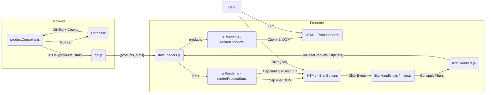

# Kế hoạch Thêm Chức năng Thống kê và Lọc nhanh Sản phẩm

**Mục tiêu:** Thêm khu vực hiển thị số lượng sản phẩm theo trạng thái (Total, Pending, Purchased) và cho phép người dùng nhấp vào các số liệu này để lọc nhanh danh sách sản phẩm.

## 1. Backend (Phía Máy chủ)

*   **Mục tiêu:** Sửa đổi API endpoint `/api/products` để tính toán và trả về số liệu thống kê cùng với danh sách sản phẩm.
*   **File cần sửa:** `tiktok-product-manager/server/controllers/productController.js`
*   **Các bước:**
    *   Trong hàm `getAllProducts`:
        *   Sau khi xác định điều kiện `where` cơ bản (cho `user_id` và `deleted_at: null`), nhưng *trước khi* áp dụng các bộ lọc cụ thể như `purchased` hoặc `tags` cho truy vấn chính.
        *   Thực hiện các truy vấn `Product.count()` riêng biệt sử dụng điều kiện `where` cơ bản để lấy:
            *   `totalCount`: Tổng số sản phẩm (không bị xóa mềm).
            *   `pendingCount`: Số sản phẩm có `purchased: false`.
            *   `purchasedCount`: Số sản phẩm có `purchased: true`.
        *   Tiếp tục thực hiện truy vấn `Product.findAll()` như hiện tại để lấy danh sách `products` dựa trên *tất cả* các bộ lọc được áp dụng (bao gồm cả `purchased` nếu có).
        *   Sửa đổi cấu trúc phản hồi JSON để trả về một đối tượng chứa cả danh sách sản phẩm và số liệu thống kê:
            ```json
            {
              "products": [ /* danh sách sản phẩm đã lọc */ ],
              "stats": {
                "total": totalCount,
                "pending": pendingCount,
                "purchased": purchasedCount
              }
            }
            ```

## 2. Frontend (Phía Trình duyệt)

*   **Mục tiêu:** Cập nhật client để yêu cầu, nhận, hiển thị số liệu thống kê và thêm các nút lọc nhanh với màu sắc riêng biệt.
*   **File cần sửa:**
    *   `tiktok-product-manager/client/index.html`
    *   `tiktok-product-manager/client/css/style.css` (Hoặc file CSS tương ứng)
    *   `tiktok-product-manager/client/js/modules/api.js`
    *   `tiktok-product-manager/client/js/modules/dataLoaders.js`
    *   `tiktok-product-manager/client/js/modules/uiRender.js`
    *   `tiktok-product-manager/client/js/modules/filterHandlers.js` (hoặc `main.js`)
*   **Các bước:**
    *   **`index.html`:**
        *   Xác định vị trí phù hợp, gần nút "Filter".
        *   Thêm các phần tử HTML cho các nút thống kê, bao gồm các lớp CSS để tạo kiểu và thuộc tính `data-filter-status`:
            ```html
            <div id="product-stats-container" class="flex space-x-2 ml-4">
                <button id="stat-total-btn" class="stat-filter-btn px-3 py-1 text-sm border rounded-md hover:bg-gray-100 data-[active='true']:border-blue-500 data-[active='true']:ring-1 data-[active='true']:ring-blue-300" data-filter-status="">
                    Total: <span id="stat-total-count" class="font-medium">0</span>
                </button>
                <button id="stat-pending-btn" class="stat-filter-btn stat-btn-pending px-3 py-1 text-sm border rounded-md hover:opacity-90 data-[active='true']:border-yellow-500 data-[active='true']:ring-1 data-[active='true']:ring-yellow-300" data-filter-status="false">
                    Pending: <span id="stat-pending-count" class="font-medium">0</span>
                </button>
                <button id="stat-purchased-btn" class="stat-filter-btn stat-btn-purchased px-3 py-1 text-sm border rounded-md hover:opacity-90 data-[active='true']:border-green-500 data-[active='true']:ring-1 data-[active='true']:ring-green-300" data-filter-status="true">
                    Purchased: <span id="stat-purchased-count" class="font-medium">0</span>
                </button>
            </div>
            ```
    *   **CSS (`style.css` hoặc tương đương):**
        *   Thêm quy tắc CSS cho các lớp `stat-btn-pending` và `stat-btn-purchased` để đặt màu nền (ví dụ: vàng nhạt và xanh lá nhạt).
        *   Thêm quy tắc CSS cho bộ chọn thuộc tính `[data-active='true']` trên các nút `.stat-filter-btn` để làm nổi bật (ví dụ: thay đổi `border-color`, thêm `ring`).
            ```css
            /* Ví dụ CSS (sử dụng Tailwind classes nếu có) */
            .stat-btn-pending {
              background-color: #FEF9C3; /* yellow-100 */
              color: #713F12; /* yellow-900 */
              border-color: #FDE68A; /* yellow-200 */
            }
            .stat-btn-purchased {
              background-color: #DCFCE7; /* green-100 */
              color: #14532D; /* green-900 */
              border-color: #BBF7D0; /* green-200 */
            }
            .stat-filter-btn[data-active='true'] {
              /* Kiểu làm nổi bật, ví dụ: */
              /* border-width: 2px; */
              /* box-shadow: 0 0 0 2px rgba(59, 130, 246, 0.5); */ /* Ring effect */
            }
            ```
    *   **JS (`api.js`):**
        *   Đảm bảo `fetchProducts` trả về toàn bộ đối tượng JSON từ backend.
    *   **JS (`dataLoaders.js`):**
        *   Trong `loadProductsList`:
            *   Nhận `response = { products, stats }`.
            *   Gọi `renderProducts(response.products)`.
            *   Gọi `renderProductStats(response.stats)`.
    *   **JS (`uiRender.js`):**
        *   Tạo hàm `renderProductStats(stats)` để cập nhật `textContent` của các span số liệu.
        *   Tạo hàm `updateActiveStatButton(activeStatus)` để thêm/xóa thuộc tính `data-active` trên các nút thống kê.
    *   **JS (`filterHandlers.js` / `main.js`):**
        *   Thêm trình xử lý sự kiện `click` cho các nút `.stat-filter-btn`.
        *   Trong trình xử lý:
            *   Lấy `data-filter-status`.
            *   Cập nhật trạng thái bộ lọc (`purchased`).
            *   Gọi `applyFilters()`.
            *   Gọi `updateActiveStatButton(newStatus)`.

## 3. Luồng Dữ liệu và Tương tác



## 4. Quyết định Thiết kế

*   **Kiểu nút:** Cơ bản với text, số lượng, và màu nền riêng cho Pending (vàng) và Purchased (xanh lá).
*   **Làm nổi bật:** Nút đang lọc sẽ được làm nổi bật (ví dụ: bằng border hoặc ring).
*   **Cập nhật số liệu:** Số liệu chỉ cần cập nhật khi tải lại trang hoặc áp dụng bộ lọc.