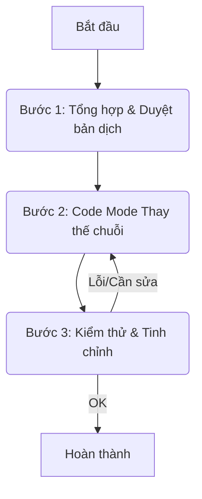

# Kế hoạch Dịch Giao diện Phần mềm sang Tiếng Việt (Phương án A: Thay thế Trực tiếp)

## 1. Phương án đã chọn

Thực hiện theo **Phương án A: Thay thế trực tiếp** để ưu tiên tốc độ hoàn thành, chấp nhận rủi ro cao hơn về lỗi tiềm ẩn và khó khăn trong bảo trì so với phương án xây dựng hệ thống i18n.

## 2. Kế hoạch Chi tiết

1.  **Bước 1: Tổng hợp và Dịch Chuỗi Văn bản (Đã hoàn thành)**
    *   **Mục tiêu:** Tạo danh sách đầy đủ các chuỗi tiếng Anh cần dịch và bản dịch tiếng Việt tương ứng.
    *   **Kết quả:** Danh sách dưới đây đã được người dùng xem xét và duyệt.

2.  **Bước 2: Thực hiện Thay thế trong Mã nguồn**
    *   **Mục tiêu:** Thay thế các chuỗi tiếng Anh bằng tiếng Việt đã được duyệt trong các tệp mã nguồn client (`.html`, `.js`).
    *   **Hành động (Thực hiện bởi Code mode):**
        *   Sử dụng công cụ `search_and_replace` hoặc `apply_diff` để thực hiện thay thế.
        *   Ưu tiên thay thế trong `tiktok-product-manager/client/index.html`.
        *   Tiếp tục thay thế trong các tệp JavaScript (`.js`) trong `tiktok-product-manager/client/js/modules/` và `tiktok-product-manager/client/js/main.js`.
        *   Thực hiện thay thế cẩn thận, theo từng nhóm nhỏ hoặc từng tệp để dễ kiểm soát.

3.  **Bước 3: Kiểm thử và Tinh chỉnh**
    *   **Mục tiêu:** Đảm bảo tất cả giao diện hiển thị đúng tiếng Việt và không có lỗi phát sinh (ví dụ: vỡ layout).
    *   **Hành động (Sau khi Code mode hoàn thành):**
        *   Chạy ứng dụng.
        *   Kiểm tra kỹ lưỡng từng màn hình, nút bấm, nhãn, thông báo, placeholder...
        *   Kiểm tra các luồng chức năng chính.
        *   Nếu phát hiện lỗi, quay lại Bước 2 để tinh chỉnh.

## 3. Sơ đồ quy trình

## 4. Danh sách Dịch đã duyệt

| Chuỗi Tiếng Anh                 | Tiếng Việt                     |
| :------------------------------ | :----------------------------- |
| Product / Products              | Sản phẩm / Các sản phẩm        |
| Add Product / Add New Product   | Thêm sản phẩm / Thêm sản phẩm mới |
| Edit Product                    | Sửa sản phẩm                   |
| Save / Save Changes             | Lưu / Lưu thay đổi             |
| Cancel                          | Hủy                            |
| Filter / Filter Products        | Lọc / Lọc sản phẩm             |
| Apply Filters                   | Áp dụng bộ lọc                 |
| Reset Filters / Reset           | Đặt lại bộ lọc / Đặt lại       |
| Tag / Tags                      | Thẻ / Các thẻ                  |
| Add tags...                     | Thêm thẻ...                    |
| Manage Tags                     | Quản lý thẻ                    |
| Add New Tag                     | Thêm thẻ mới                   |
| Save Tag                        | Lưu thẻ                        |
| Cancel Edit                     | Hủy chỉnh sửa                  |
| Notes                           | Ghi chú                        |
| Add notes...                    | Thêm ghi chú...                |
| Dashboard                       | Bảng điều khiển                |
| Goals                           | Mục tiêu                       |
| Add Goal / Add/Update Monthly Goal | Thêm mục tiêu / Thêm/Cập nhật Mục tiêu tháng |
| Save Goal                       | Lưu mục tiêu                   |
| Product Goal                    | Mục tiêu sản phẩm              |
| Video Goal                      | Mục tiêu video                 |
| Category Goal(s)                | Mục tiêu danh mục              |
| Add Category Goal               | Thêm mục tiêu danh mục         |
| Trash                           | Thùng rác                      |
| Restore / Restore Product       | Khôi phục / Khôi phục sản phẩm |
| Delete Product                  | Xóa sản phẩm (vào thùng rác)   |
| Permanent Delete                | Xóa vĩnh viễn                  |
| Purchased                       | Đã mua                         |
| Pending                         | Chờ xử lý / Đang chờ           |
| Actions                         | Hành động                      |
| Search...                       | Tìm kiếm...                    |
| Image                           | Hình ảnh                       |
| Click to zoom                   | Nhấn để phóng to               |
| Loading...                      | Đang tải...                    |
| Error / Failed to load...       | Lỗi / Tải thất bại...          |
| No products found.              | Không tìm thấy sản phẩm nào.   |
| Are you sure...?                | Bạn có chắc chắn...?           |
| Authentication failed           | Xác thực thất bại              |
| View All                        | Xem tất cả                     |
| Total Products                  | Tổng số sản phẩm               |
| Recent Products                 | Sản phẩm gần đây               |
| Settings                        | Cài đặt                        |
| Login                           | Đăng nhập                      |
| Logout                          | Đăng xuất                      |